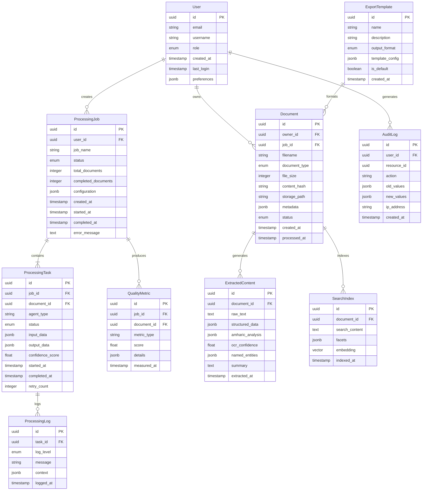

# Data Model: Amharic Document Preparation System

**Feature**: 001-build-a-comprehensive  
**Date**: 2025-01-26  
**Phase**: 1 - Data Architecture and Entity Design  

## Entity Relationship Overview



## Core Entities

### User
**Purpose**: System users with role-based access control  
**Storage**: PostgreSQL primary table  
**Key Features**: 
- Role-based permissions (admin, processor, viewer)
- User preferences for UI and processing options
- Audit trail integration

```python
from pydantic import BaseModel, EmailStr
from enum import Enum
from datetime import datetime
from uuid import UUID
from typing import Optional, Dict, Any

class UserRole(str, Enum):
    ADMIN = "admin"
    PROCESSOR = "processor" 
    VIEWER = "viewer"

class UserPreferences(BaseModel):
    language: str = "en"
    default_export_format: str = "pdf"
    notifications_enabled: bool = True
    batch_size_preference: int = 10

class User(BaseModel):
    id: UUID
    email: EmailStr
    username: str
    role: UserRole
    created_at: datetime
    last_login: Optional[datetime] = None
    preferences: UserPreferences = UserPreferences()
    is_active: bool = True
```

### Document
**Purpose**: Core document entity representing uploaded files and processing results  
**Storage**: PostgreSQL for metadata, MinIO for file storage, MongoDB for processed content  
**Key Features**:
- Content-based deduplication using SHA-256 hashes
- Multi-format support with type-specific metadata
- Processing status tracking

```python
class DocumentType(str, Enum):
    PDF = "pdf"
    IMAGE = "image"
    WORD = "word"
    CSV = "csv"
    WEB_CONTENT = "web_content"
    
class DocumentStatus(str, Enum):
    UPLOADED = "uploaded"
    QUEUED = "queued"
    PROCESSING = "processing"
    COMPLETED = "completed"
    FAILED = "failed"
    ARCHIVED = "archived"

class DocumentMetadata(BaseModel):
    original_name: str
    mime_type: str
    page_count: Optional[int] = None
    language_detected: Optional[str] = None
    creation_date: Optional[datetime] = None
    author: Optional[str] = None
    encryption_status: Optional[str] = None

class Document(BaseModel):
    id: UUID
    owner_id: UUID
    job_id: Optional[UUID] = None
    filename: str
    document_type: DocumentType
    file_size: int
    content_hash: str  # SHA-256 for deduplication
    storage_path: str  # MinIO object key
    metadata: DocumentMetadata
    status: DocumentStatus
    created_at: datetime
    processed_at: Optional[datetime] = None
    error_message: Optional[str] = None
```

### ProcessingJob
**Purpose**: Orchestrates batch document processing with progress tracking  
**Storage**: PostgreSQL with job configuration as JSONB  
**Key Features**:
- Batch processing coordination
- Progress tracking and ETA calculation
- Error handling and retry logic

```python
class JobStatus(str, Enum):
    CREATED = "created"
    RUNNING = "running"
    COMPLETED = "completed"
    FAILED = "failed"
    CANCELLED = "cancelled"
    PAUSED = "paused"

class JobConfiguration(BaseModel):
    ocr_languages: List[str] = ["amh", "eng"]
    quality_threshold: float = 0.85
    enable_spell_check: bool = True
    enable_ner: bool = True
    output_formats: List[str] = ["pdf", "docx"]
    batch_size: int = 10
    priority: int = 1  # 1-5 scale, 5 being highest

class ProcessingJob(BaseModel):
    id: UUID
    user_id: UUID
    job_name: str
    status: JobStatus
    total_documents: int
    completed_documents: int = 0
    configuration: JobConfiguration
    created_at: datetime
    started_at: Optional[datetime] = None
    completed_at: Optional[datetime] = None
    estimated_completion: Optional[datetime] = None
    error_message: Optional[str] = None
    
    @property
    def progress_percentage(self) -> float:
        if self.total_documents == 0:
            return 0.0
        return (self.completed_documents / self.total_documents) * 100
```

### ProcessingTask
**Purpose**: Individual agent tasks within processing jobs  
**Storage**: PostgreSQL with input/output data as JSONB  
**Key Features**:
- Agent-specific task tracking
- Retry logic with exponential backoff
- Confidence scoring and quality metrics

```python
class TaskStatus(str, Enum):
    PENDING = "pending"
    RUNNING = "running"
    COMPLETED = "completed"
    FAILED = "failed"
    RETRYING = "retrying"
    CANCELLED = "cancelled"

class AgentType(str, Enum):
    ORCHESTRATOR = "orchestrator"
    DOCUMENT_ANALYZER = "document_analyzer"
    PDF_EXTRACTOR = "pdf_extractor"
    IMAGE_OCR = "image_ocr"
    WORD_EXTRACTOR = "word_extractor"
    CSV_PROCESSOR = "csv_processor"
    WEB_SCRAPER = "web_scraper"
    AMHARIC_NLP = "amharic_nlp"
    QUALITY_ASSURANCE = "quality_assurance"

class ProcessingTask(BaseModel):
    id: UUID
    job_id: UUID
    document_id: UUID
    agent_type: AgentType
    status: TaskStatus
    input_data: Dict[str, Any]
    output_data: Optional[Dict[str, Any]] = None
    confidence_score: Optional[float] = None
    started_at: Optional[datetime] = None
    completed_at: Optional[datetime] = None
    retry_count: int = 0
    max_retries: int = 3
    error_message: Optional[str] = None
```

### ExtractedContent
**Purpose**: Processed document content with Amharic-specific analysis  
**Storage**: MongoDB for full-text storage, Elasticsearch for search indexing  
**Key Features**:
- Multi-language text analysis
- Named entity recognition
- Document structure preservation

```python
class AmharicAnalysis(BaseModel):
    word_count: int
    sentence_count: int
    paragraph_count: int
    language_confidence: float
    script_type: str  # "ge'ez", "latin", "mixed"
    readability_score: Optional[float] = None

class NamedEntity(BaseModel):
    text: str
    entity_type: str  # PERSON, PLACE, ORG, DATE, etc.
    start_position: int
    end_position: int
    confidence: float
    amharic_canonical: Optional[str] = None

class StructuredData(BaseModel):
    headers: List[Dict[str, Any]]
    paragraphs: List[Dict[str, Any]]
    tables: List[Dict[str, Any]]
    images: List[Dict[str, Any]]
    footnotes: List[Dict[str, Any]]

class ExtractedContent(BaseModel):
    id: UUID
    document_id: UUID
    raw_text: str
    structured_data: StructuredData
    amharic_analysis: AmharicAnalysis
    ocr_confidence: Optional[float] = None
    named_entities: List[NamedEntity]
    summary: Optional[str] = None
    extracted_at: datetime
```

### QualityMetric
**Purpose**: Quality assurance metrics for document processing validation  
**Storage**: PostgreSQL with metric details as JSONB  
**Key Features**:
- OCR accuracy tracking
- Processing performance metrics
- Content quality validation

```python
class MetricType(str, Enum):
    OCR_ACCURACY = "ocr_accuracy"
    LANGUAGE_DETECTION = "language_detection" 
    STRUCTURE_EXTRACTION = "structure_extraction"
    NER_CONFIDENCE = "ner_confidence"
    PROCESSING_TIME = "processing_time"
    CONTENT_COMPLETENESS = "content_completeness"

class MetricDetails(BaseModel):
    measurement_method: str
    reference_data: Optional[str] = None
    sample_size: Optional[int] = None
    threshold_passed: bool
    improvement_suggestions: List[str] = []

class QualityMetric(BaseModel):
    id: UUID
    job_id: Optional[UUID] = None
    document_id: UUID
    metric_type: MetricType
    score: float  # 0.0 to 1.0
    details: MetricDetails
    measured_at: datetime
```

### SearchIndex
**Purpose**: Optimized search representation for document discovery  
**Storage**: Elasticsearch with vector embeddings for semantic search  
**Key Features**:
- Full-text search with Amharic stemming
- Faceted search capabilities
- Semantic similarity search

```python
class SearchFacets(BaseModel):
    document_type: str
    language: str
    author: Optional[str] = None
    date_range: Optional[str] = None
    topic_categories: List[str] = []
    processing_quality: str  # "high", "medium", "low"

class SearchIndex(BaseModel):
    id: UUID
    document_id: UUID
    search_content: str  # Processed for full-text search
    facets: SearchFacets
    embedding: Optional[List[float]] = None  # Vector embedding for semantic search
    indexed_at: datetime
```

## Data Storage Strategy

### PostgreSQL Tables (Structured Data)
- **users**: User accounts and authentication
- **documents**: Document metadata and references
- **processing_jobs**: Batch processing orchestration
- **processing_tasks**: Individual agent task tracking
- **quality_metrics**: QA measurements and validation
- **audit_logs**: Security and compliance logging
- **export_templates**: Output formatting configurations

### MongoDB Collections (Document Storage)
- **extracted_content**: Full processed document content
- **document_versions**: Historical versions and changes
- **processing_cache**: Temporary processing data
- **user_sessions**: Active processing sessions

### MinIO Buckets (Object Storage)
- **raw-documents**: Original uploaded files
- **processed-documents**: Generated output files
- **temporary-files**: Processing intermediate files (TTL: 24h)
- **backups**: Automated backup archives
- **templates**: Export template files

### Elasticsearch Indexes
- **documents**: Full-text search with Amharic analysis
- **entities**: Named entity search and discovery
- **audit**: Log search and analysis

## Data Validation Rules

### Document Upload Validation
- Maximum file size: 100MB (as per specification)
- Supported MIME types: PDF, JPG, PNG, TIFF, BMP, DOCX, DOC, CSV
- Content scanning for malware and corruption
- Duplicate detection using content hashes

### Processing Validation
- OCR confidence threshold: 85% minimum for automatic approval
- Language detection confidence: 75% minimum for Amharic classification
- Text extraction completeness: 90% of expected content

### Data Integrity Constraints
- All foreign key relationships enforced
- Cascade deletion with audit trail preservation
- Immutable audit logs and quality metrics
- Encrypted storage for sensitive content

## Performance Optimization

### Database Indexing Strategy
```sql
-- PostgreSQL Indexes
CREATE INDEX idx_documents_owner_status ON documents(owner_id, status);
CREATE INDEX idx_processing_jobs_user_created ON processing_jobs(user_id, created_at DESC);
CREATE INDEX idx_processing_tasks_job_agent ON processing_tasks(job_id, agent_type);
CREATE INDEX idx_quality_metrics_document_type ON quality_metrics(document_id, metric_type);

-- MongoDB Indexes  
db.extracted_content.createIndex({ "document_id": 1, "extracted_at": -1 });
db.extracted_content.createIndex({ "amharic_analysis.word_count": 1 });

-- Elasticsearch Mappings
PUT documents
{
  "mappings": {
    "properties": {
      "content": {
        "type": "text",
        "analyzer": "amharic_analyzer"
      },
      "entities": {
        "type": "nested"
      }
    }
  }
}
```

### Caching Strategy
- Redis caching for frequently accessed document metadata
- Application-level caching for user preferences and templates
- CDN caching for static export templates and UI assets

### Data Retention Policies
- Raw documents: 2 years retention, then archive to cold storage
- Processing logs: 6 months retention, then purge (except errors)
- Audit logs: 7 years retention (compliance requirement)
- Temporary files: 24 hours TTL with automatic cleanup

## Migration and Versioning

### Schema Migration Strategy
- Alembic for PostgreSQL schema versions
- MongoDB schema flexibility with validation rules
- Elasticsearch index versioning with alias switching
- Backward compatibility for at least 2 major versions

### Data Export Capabilities
- Full user data export (GDPR compliance)
- Selective document export by date range or type
- Metadata-only export for system migration
- Encrypted backup format with integrity verification

This data model provides a robust foundation for the Amharic Document Preparation System with proper separation of concerns, scalability considerations, and comprehensive audit capabilities.